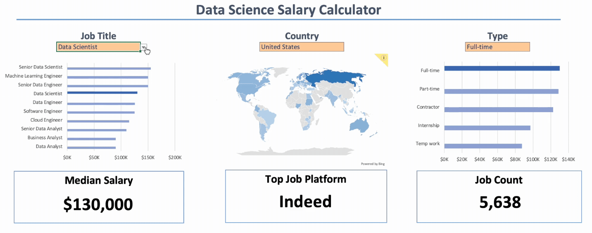
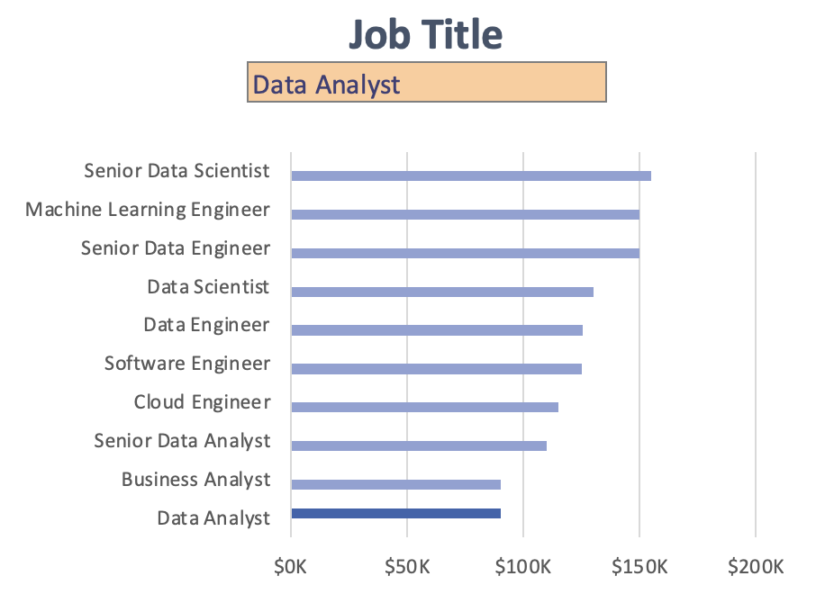
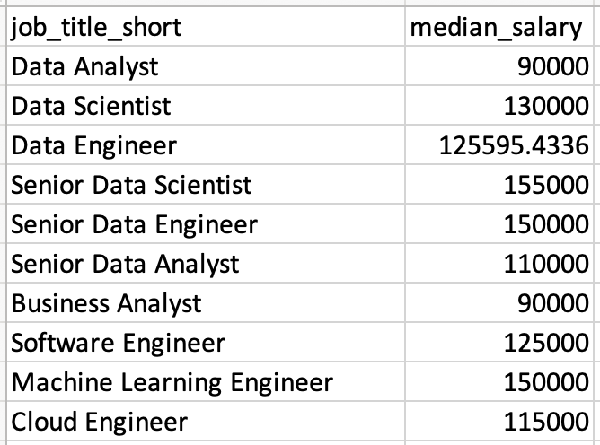
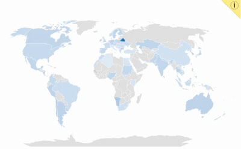
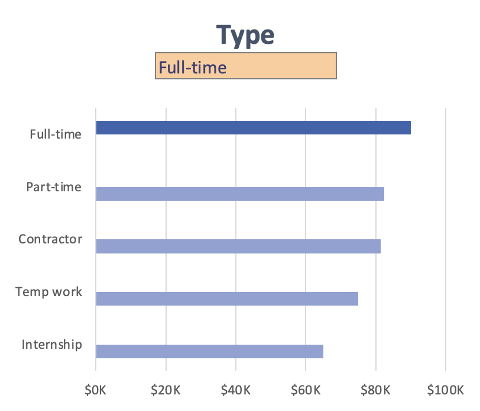
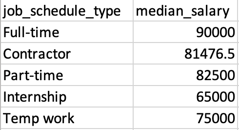
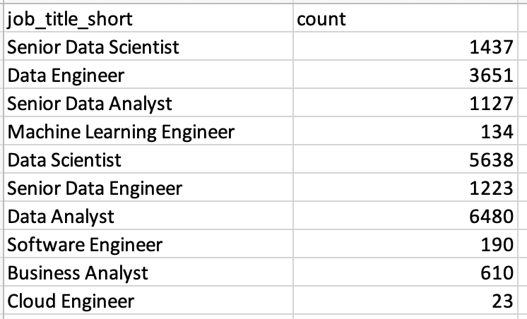
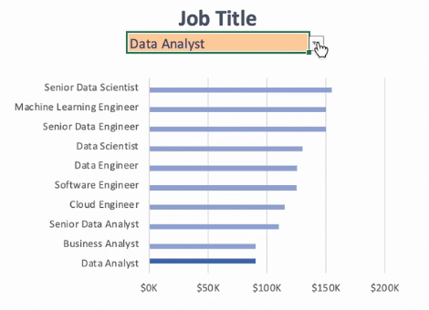

# Excel Salary Dashboard


## Introduction
In this project, I developed an interactive Excel dashboard to analyze data job postings across different countries, job titles, and employment types. The dashboard allows users to explore salary trends, job availability, and hiring platforms based on dropdown inputs.

Check out the Dashboard here: [Salary Dashboard](./Excel_Project-Data_Analytics/Salary_Dashboard.xlsx)

### Excel Skills Used
The following Excel skills were used in this analysis:
- **Formulas and Functions**: Formulas used to filter salaries by job title, country, and employment type, with aggregate functions used to calculate median salary and job counts.
- **Data Validation**: Created dropdown menus for dynamic filtering of job titles, countries, and employment types.
- **Charts and Data Visualization**: Built charts to easily identify trends in salary, geographic availability, and employment types.

### Jobs Dataset
The [dataset](./Excel_Project-Data_Analytics/Data.xlsx) used for this project includes 32,673 real-world data job postings from 2023. It includes information on:

- Job titles
- Salaries
- Locations
- Skills

## Building the Dashboard
### Job Title Bar Chart


**Chart design choices:**
- Horizontal bar chart to easily read job titles and compare salaries
- Formatted salary values for clarity and quick comparison
- Titles ordered by descending salary for easy comparison
- Selected job title is highlighted for quick reference

**How It Works:**
```
=MEDIAN(
  IF(
    (jobs[job_title_short]=A2)*
    (jobs[salary_year_avg]<>0)*
    (jobs[job_country]=country)*
    (ISNUMBER(SEARCH(type,jobs[job_schedule_type]))),
    jobs[salary_year_avg]
  )
)
```
- Checks the job title, country, and schedule type, while excluding blank salaries
- Finds the median salary of all records that meet the requirements
- Used to populate the table shown below, returning median salary for each job title based on the selected country and employment type



### Country Map


**Graph design choices:**
- Utilized Excel's map chart for quick understanding of median salaries by country/region
- Color-coded so that countries with higher median salaries are immediately identified by a darker color
- Contains many data points in a limited area while remaining easy to read

**How It Works:**
```
=MEDIAN(
    IF(
        (jobs[job_country]=A2)*
        (jobs[salary_year_avg]<>0)*
        (jobs[job_title_short]=title)*
        (ISNUMBER(SEARCH(type,jobs[job_schedule_type]))),
        jobs[salary_year_avg]
    )
)
```
- Similar to the Job Title calculation, it checks that the job title and employment type matches user inputs, and that the salary is not blank
- Finds the median salary of the country in column A where requirements are met

### Employment Type Bar Chart


**Graph design choices:**
- Similar to the Job Title chart, salaries by employment type are easily identifiable
- Chart formatted for ease of comparison and readability

**How It Works:**
```
=FILTER(J2#,NOT(ISNUMBER(SEARCH("and",J2#)))*(J2#<>0))
```
- Filters out job types that contain more than one type (ex. "Full-time and Part-time") by not including values that contain "and"
- Also cleans the data, removing values that equal "0"
- Outputs an array of cleaned employment-type values, shown in the table below



```
 (ISNUMBER(SEARCH(A2,jobs[job_schedule_type])))
```
- This line checks whether the selected employment type appears anywhere within the `job_schedule_type` field. This includes both exact matches (ex. "Contractor") and combined employment types (ex "Full-time and Contractor").
- If this condition is TRUE and the selected job title, country, and non-zero salary requirements are also met, the salary is included in the median calculation below:

```
=MEDIAN(
  IF(
    (jobs[job_title_short]=title)*
    (jobs[salary_year_avg]<>0)*
    (jobs[job_country]=country)*
    (ISNUMBER(SEARCH(A2,jobs[job_schedule_type]))),
    jobs[salary_year_avg]
  )
)
```

### KPI Cards

**Median Salary**


- Utilizes `XLOOKUP()` to find where the selected job title matches the title in the salary table, then outputs the corresponding salary

**Top Job Platform**


```=COUNTIFS(jobs[job_via],A2,jobs[job_title_short],title,jobs[job_country],country,jobs[job_schedule_type],type)```

- Used to count the number of jobs from each platform where job title, country, and employment type match user inputs
- Platforms are then sorted and cleaned to find which has the most jobs that meet the criteria

**Job Count**


```
=COUNT(
    IF(
        (jobs[job_country]=country)*
        (jobs[job_title_short]=A2)*
        (ISNUMBER(SEARCH(type,jobs[job_schedule_type]))),
        jobs[salary_year_avg]
    )
)
```
- Checks the country, job title, and employment type, then counts the number of jobs that meet those requirements
- Outputs values as shown below



- `XLOOKUP()` then used to find the job count of the user-selected job title

### Data Validation


Using pre-defined lists for the `Job Title`, `Country`, and `Employment Type` dropdowns in the dashboard ensures:
- User is restricted to select only validated values
- Dashboard does not break when values are selected
- User can quickly change values making comparison quicker and easier
- Overall usability of the dashboard is improved

## Conclusion

This project helped to strengthen my understanding of Excel functions, charts, and dashboard design principles while transforming raw job-posting data into an interactive analytical tool. Users can use this dashboard to compare salaries, explore hiring demand across countries, and identify the most common employment types and job platforms within the data market.
